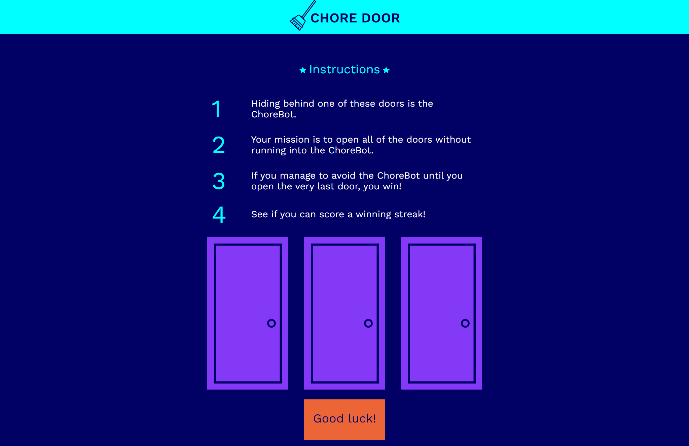

# Chore Door

Chore-Door is a fun and simple door-clicking game where players must try to avoid the hidden chore-bot behind one of three doors. The player selects doors one at a time, aiming to open all doors without uncovering the robot. Behind each door could be the chore-bot or a relaxing scene, and the goal is to outsmart the random placement of the chore-bot.

The game continues until the player wins by opening all safe doors or loses by uncovering the chore-bot. After each game, players have the option to play again with a new randomized door arrangement.

This is a practice project for the Codecademy Full Stack Engineer career path

## Table of Contents

- [Screenshots](#screenshots)
- [Deployment](#deployment)
- [Usage](#usage)
- [Questions](#questions)

## Screenshots

## Deployment

[Chore Door](https://zolotavina.github.io/chore-door/)

## Usage

Click on the [link](https://zolotavina.github.io/chore-door/) to access Chore Door game.

## Questions

Open an issue if you have any questions about the repo. You can find more of my work [here](https://github.com/zolotavina).